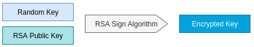
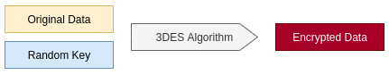
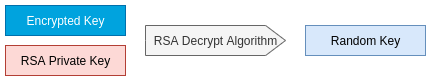
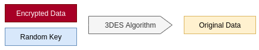
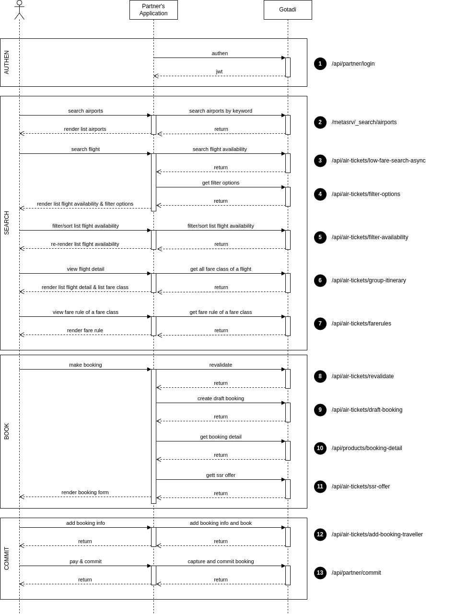

## Summary

This document describes issues related to the implementation of an API connection between a Agency Partner (hereinafter referred to as a Partner) and Gotadi. Allows users on the Partner's system to search and book flights/hotels/tours/combos of Gotadi through the application provided by the Partner.

---

## Refferrence documentation

- Connection information between Gotadi and the Partner.
- Test script
- Sample source code

---

## Terms

- **URL** `Uniform Resource` are used to refer to resources on the Internet.
- **SSL** `Secure Sockets Layer` are cryptographic protocols designed to provide secure communications over the Internet.
- **HTTPS** `Hypertext Transfer Protocol Secure` is a protocol that combines the HTTP protocol and the SSL or TLS security protocol that allows the secure exchange of information on the Internet.
- **3DES** `Triple DES (3DES or TDES)` is a symmetric key algorithm that applies the DES encryption algorithm three times to each block of data.
- **RSA** `Rivest–Shamir–Adleman` is a public key cryptographic algorithm. This is the first algorithm that appropriate for generating digital signatures at the same time as encryption.
- **SHA-256** `Secure Hash Algorithm` is an algorithm used to convert a certain piece of data into a constant length data segment with high distinct probability. SHA-256 (returns a 256-bit long result)
- **Electronic signature** Information accompanying data (text, images, videos, etc.) for the purpose of identifying the owner of such data
---

## Security Requirements

### SSL/HTTPS channel

SSL/HTTPS is applied to transmit and receive data between the partner's system and Gotadi. The purpose of using SSL/HTTPS is to make the data exchanged between partners and Gotadi encrypted, and challenging to be stolen and tampered with.

### Security header and traffic statistics

All requests from the partner to Gotadi's system must contain the following Headers to serve Gotadi's security and statistics operations:
```
apikey: <api_key>
x-ibe-req-name: <access_code>
```
!!! note "Note"
    `<api_key>` and `<access_code>` values provided by Gotadi to Partners.

### Encryption of transmitted data and digital signature authentication

Request/response between Gotadi and the Partner in some important APIs are required to be encrypted using 3DES asymmetric encryption algorithm and accompanied by a digital signature for authentication. Encryption and decryption algorithms will be described in detail in this document.
!!! note "Note"
    APIs that require data encryption and digital signatures are noted in the Security requirements section

#### Encrypt outgoing data

**Input** Original data, receiver's RSA PublicKey, sender's RSA Private Key

**Output** Encrypted Key, Encrypted Data

???+ tip "Step 1: Generate random key"

    
    
    The 3DES Key Generate function is used to generate a random key based on the criteria DESedeKeySpec (Key length: 24 bytes). Each request/response will be given a unique random key.

    Example: 
    === "Java"
        ```java
            public static byte[] generateKey() throws Exception {
                KeyGenerator keyGenerator = KeyGenerator.getInstance("DESede");
                SecretKey secretKey = keyGenerator.generateKey();
                SecretKeyFactory secretKeyFactory = SecretKeyFactory.getInstance("DESede");
                DESedeKeySpec deSedeKeySpec = (DESedeKeySpec) 	secretKeyFactory.getKeySpec(secretKey, DESedeKeySpec.class);
                byte[] randomKey = deSedeKeySpec.getKey();
                return randomKey;
            }

        ```

???+ tip "Step 2: Encrypt random key"

    

    The random key generated in step 1 will be encrypted using the RSA asymmetric encryption algorithm using the recipient's public key.
    
    Example: 
    === "Java"
        ```java 
        public static String encryptRSA(byte[] randomKey, String xmlPublicKey) throws Exception {
            Cipher cipher = createCipherEncrypt(xmlPublicKey);
            byte[] encryptedKey = cipher.doFinal(randomKey);
            return Base64.encodeBase64URLSafeString(encryptedKey);
        }

        ```

???+ tip "Step 3: Generate digital signature"

    

    The sender applies the RSA-SHA256 algorithm in combination with its own private key to sign the digital signature on the signature data.

    !!! note "Note"
        Schema to establish signature data will be described in detail in each API.

    Example:
    === "Java"
        ```java
        public static String signRSA(String signatureData, String xmlPrivateKey) throws Exception {
            PrivateKey privateKey = getPrivateKeyFromXML(xmlPrivateKey);
            Signature instance = Signature.getInstance("SHA256withRSA");
            instance.initSign(privateKey);
            instance.update(signatureData.getBytes("UTF-8"));
            byte[] signature = instance.sign();
            return Base64.encodeBase64String(signature);
        }

        ```

???+ tip "Step 4: Encrypt data"

    

    Original data containing the signature will be encrypted using the 3DES algorithm with the random key generated in the previous step.

    !!! note "Note"
        Schema to establish signature data will be described in detail in each API.

    Example:
    === "Java"
        ```java
        public static String encryptTripleDes(String originalData, byte[] randomKey) throws Exception {
            Cipher cipher = Cipher.getInstance("DESede");
            SecretKeySpec secretKeySpec = new SecretKeySpec(randomKey, "DESede");
            cipher.init(Cipher.ENCRYPT_MODE, secretKeySpec);
            byte[] encryptedData = cipher.doFinal(originalData.getBytes("UTF-8"));
            return Base64.encodeBase64URLSafeString(encryptedData);
        }

        ```

#### Decrypt the received data and verify the electronic signature

**Input** Encrypted Key, Encrypted Data, Receiver's RSA PrivateKey, Sender's RSA PublicKey

**Output** Original Data, Verify Result

???+ tip "Step 1: Decrypt 3DES random key"

    

    The Receiver uses its Own private key to decrypt the received encrypted key.

    Example:
    === "Java"
        ```java
        public static byte[] decryptRSAToByte(String encryptedKey, String xmlPrivateKey) throws Exception {
            Cipher cipher = createCipherDecrypt(xmlPrivateKey);
            byte[] bts = Base64.decodeBase64(encryptedKey);
            byte[] randomKey = cipher.doFinal(bts);
            return randomKey;
        }

        ```

???+ tip "Step 2: Decrypt Data"

    

    The receiver applies the 3DES algorithm combined with the random key obtained in the previous step, decrypting the encrypted data to receive the original data containing the signature.

    !!! note "Note"
        The receiver applies the 3DES algorithm combined with the random key obtained in the previous step, decrypting the encrypted data to receive the original data containing the signature.

    Example:
    === "Java"
        ```java
        public static String decryptTripleDes(String encryptedData, byte[] randomKey) throws Exception {
            Cipher cipher = Cipher.getInstance("DESede");
            SecretKeySpec secretKeySpec = new SecretKeySpec(randomKey, "DESede");
            cipher.init(Cipher.DECRYPT_MODE, secretKeySpec);
            byte[] originalData  = cipher.doFinal(Base64.decodeBase64(encryptedData));
            return new String(originalData, "UTF-8");
        }

        ```

???+ tip "Step 3: Verify digital signature"

    

    The receiver uses the RSA-SHA256 Algorithm and the sender's Public key to verify the signature extracted from the original data.

    Example:
    === "Java"
        ```java
        public static boolean verifyRSA(String signedData, String signature, String xmlPublicKey) throws Exception {
            PublicKey publicKey = getPublicKeyFromXML(xmlPublicKey);
            Signature instance = Signature.getInstance("SHA256withRSA");
            instance.initVerify(publicKey);
            instance.update(signedData.getBytes("UTF-8"));
            return instance.verify(Base64.decodeBase64(signature));
        }
        ```

---

### Abbreviation conventions

| Acronym  | Full Word     | Description                                 |
| --------- | ------------- | ------------------------------------- |
| M         | `Mandatory`   | Required when calling API         |
| O         | `Optional`    | Not required when calling the API, depending on the purpose of use, whether this parameter is passed |
| C         | `Condition`   | Based on the Condition of another field when calling the API, this field is decided as Mandatory or Optional |

### HTTP Response code

| Response code | Description                                 |
| ------------- | ------------------------------------- |
| 200           | Success                               |
| 400           | Bad Request                           |
| 401           | Unauthorized                          |
| 402           | Forbidden                             |
| 402           | Not Found                             |
| 500           | Internal Server Error                 |
| 503           | Service Unavailable                   |

### Common parameters

| Parameter | Type             | Description                                                                                                                                                               |
| --- |------------------|---------------------------------------------------------------------------------------------------------------------------------------------------------------------------|
| page | Integer, Optional | Page number (starting at 0)                                                                                                                                               |
| size | Integer, Optional | Number of elements of each page                                                                                                                                           |
| sort | String, Optional | Arrays contain field names and data types.                                                                                                 Ex: id, desc, createdDate, asc |
| duration | String, Optional | Request processing time - From the time of receiving the request to the time of returning the result.                                     |
| success | Boolean, Required | Result of request processing                                                                                                              |
| infos | Object[], Optional | The array contains information describing the results at the steps in the request processing.                                             |
| errors | Object[], Optional | The array contains information describing the errors that occurred during request processing.                                             |
| textMessage | String, Optional | Suggested messages are shown to the user.                                                                                                 |
| pageDTO | PageDTO, Optional | Object that describes pagination information: Sequence number of pages returned, number of elements per page, total number of pages, etc. |

### Interactive flow



### Error Code

| Error Code | Description |
| --- | --- |
| 00 | The request has been processed successfully |
| 01 | The request is being processed |
| 02 | The request was processed failed |
| 03 | The request was denied due to a failure of the Reseller Account Authentication |
| 04 | Request rejected due to invalid e-Signature |
| 05 | Request rejected due to failed Data Decryption |
| 06 | Request denied due to invalid Access Code |
| 07 | Request rejected due to malformed data |
| 08 | The request was rejected because it has been processed before |
| 09 | The request has not been processed |
| 10 | Account information not found |
| 99 | Other error |