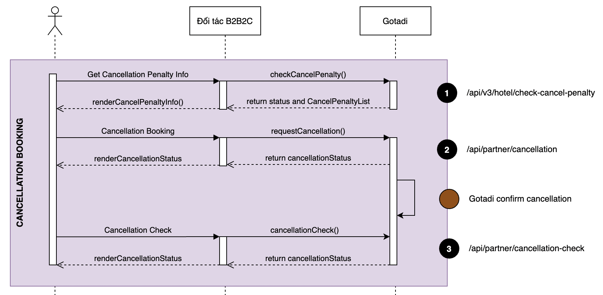

# Document Hotel API Cancellation 



## Mô tả hình thức phạt khi huỷ 
                                
Nếu không nhận phòng, hoặc nếu hủy hay thay đổi đặt phòng này sau thời gian nhận phòng, thì bạn có thể phải chịu phí phạt lên đến `100%` giá trị đặt phòng.

### Các hình thức phạt

#### Ví dụ 1: Phạt theo đêm  
```json
[{
    "startDate": "2021-05-12T18:00:00.000+07:00",
    "endDate": "2021-05-13T18:00:00.000+07:00",
    "type": "NIGHTS",
    "currency": "VND",  
    "percent": "",  
    "nights": "1.0",
    "amount": "",
    "description": ""
}]
```

- Được hủy miễn phí đến trước ngày `2021-05-12T18:00:00.000+07:00`  

- Phạt `1` đêm khi hủy phòng từ ngày `2021-05-12T18:00:00.000+07:00` đến ngày `2021-05-13T18:00:00.000+07:00`  

#### Ví dụ 2: Phạt theo giá tiền 
```json
[{
    "startDate": "2021-05-12T18:00:00.000+07:00",
    "endDate": "2021-05-13T18:00:00.000+07:00",
    "type": "AMOUNT",
    "currency": "VND",
    "percent": "",
    "nights": "",
    "amount": "200000",
    "description": ""
}]
```

- Được hủy miễn phí đến trước ngày `2021-05-12T18:00:00.000+07:00`  

- Bị Phạt `200000` `VND` khi hủy phòng từ ngày `2021-05-12T18:00:00.000+07:00` đến ngày `2021-05-13T18:00:00.000+07:00`  

#### Ví dụ 3: Phạt theo phần trăm 
```json
[{
    "startDate": "2021-05-12T18:00:00.000+07:00",
    "endDate": "2021-05-13T18:00:00.000+07:00",
    "type": "PERCENT",
    "currency": "VND",
    "percent": "70%",
    "nights": "",
    "amount": "",
    "description": ""
}]
```

- Được hủy miễn phí đến trước ngày `2021-05-12T18:00:00.000+07:00`  
    
- Bị Phạt `70%` giá trị của phòng khi hủy phòng từ ngày `2021-05-12T18:00:00.000+07:00` đến ngày `2021-05-13T18:00:00.000+07:00`  
        
#### Ví dụ 4: Nhiều hình phạt  
```json
[{
    "startDate": "2021-05-10T18:00:00.000+07:00",
    "endDate": "2021-05-12T18:00:00.000+07:00",
    "type": "PERCENT",
    "currency": "VND",
    "percent": "50%",
    "nights": "",
    "amount": "",
    "description": ""
},
{
    "startDate": "2021-05-12T18:00:00.000+07:00",
    "endDate": "2021-05-13T18:00:00.000+07:00",
    "type": "PERCENT",
    "currency": "VND",
    "percent": "70%",
    "nights": "",
    "amount": "",
    "description": ""
}]
```

- Được hủy miễn phí đến trước ngày `2021-05-10T18:00:00.000+07:00`  

- Bị Phạt `50%` giá trị của phòng khi hủy phòng từ ngày `2021-05-10T18:00:00.000+07:00` đến ngày `2021-05-12T18:00:00.000+07:00`  

- Bị Phạt `70%` giá trị của phòng khi hủy phòng từ ngày `2021-05-12T18:00:00.000+07:00` đến ngày `2021-05-13T18:00:00.000+07:00`  
    
#### Ví dụ 5: Nhiều hình phạt  
```json
[{
    "startDate": "2021-05-10T18:00:00.000+07:00",
    "endDate": "2021-05-12T18:00:00.000+07:00",
    "type": "PERCENT",
    "currency": "VND",
    "percent": "50%",
    "nights": "",
    "amount": "25000",
    "description": ""
}]
```

- Được hủy miễn phí đến trước ngày `2021-05-10T18:00:00.000+07:00`  
        
- Bị Phạt `50%` giá trị của phòng khi hủy phòng từ ngày `2021-05-10T18:00:00.000+07:00` đến ngày `2021-05-12T18:00:00.000+07:00` kèm theo khoản phí  
        
- Bị phạt `25000` `VND` tiền phí khi hủy phòng từ ngày `2021-05-10T18:00:00.000+07:00` đến ngày `2021-05-12T18:00:00.000+07:00`  
            
#### Ví dụ 6: Hủy miễn phí 
```json
[{
    "startDate": "2021-05-01T18:00:00.000+07:00",
    "endDate": "2021-05-12T18:00:00.000+07:00",
    "type": "NIGHTS",
    "currency": "VND",
    "percent": "",
    "nights": "0",
    "amount": "",
    "description": ""
}]
```

- Được hủy miễn phí đến trước ngày `2021-05-12T18:00:00.000+07:00`  

---

## 1. API Kiểm tra khả năng huỷ phòng và phí phạt 

!!! info "POST: /api/v3/hotel/check-cancel-penalty"
    Trả về thông tin trạng thái khả năng huỷ phòng, và thông tin phí phạt khi huỷ. 

### Request Body 
=== "Model"
    ???+ example "Request Body"
        - bookingNumber (String, Required)

            !!! quote ""

                Mã dùng tham chiếu đến booking. Mã này là duy nhất.

=== "Example"
    ```json 
    {
        "bookingNumber":"HDCO2107121213651"
    }
    ```

### Response 
#### Code 200
> OK

=== "Model" 
    ???+ example "Model"
        - result (CheckCancelPenaltyResult, Optional)

            !!! quote ""

                Thông tin kết quả trả về 

            - status (string, optional) = ['ALLOW_CANCELLATION', 'NOT_ALLOW_CANCELLATION', 'UNKNOWN']

                !!! quote "" 

                    Thông tin xác định trạng thái huỷ phòng  
                    
                    - `ALLOW_CANCELLATION`: Chấp nhận huỷ phòng  

                    - `NOT_ALLOW_CANCELLATION`: Không chấp nhận huỷ phòng 

                    - `UNKNOWN`: Không xác định trạng thái, cần được xác định lại  

            - cancelPenalties (Array[CancelPenalty], optional),

                !!! quote ""

                    Thông tin phí phạt khi huỷ phòng. [Xem mô tả thêm ở đây](/dev-guide/api-hotel/api-cancellation/#cac-hinh-thuc-phat)

            - cancelPenaltyTotal (number, optional),

                !!! quote ""

                    Thông tin phí phạt khi huỷ phòng 

        - duration (Integer, Optional)
        - success (Integer, Bool)
        - infos (Array[InfosDTO], Optional)
        - errors (Array[ErrorsDTO], Optional)
        - textMessage (String, Optional)

=== "Example"
    ```json 
    {
        "result": {
            "cancelPenalties": [
                {
                    "amount": "",
                    "currency": "VND",
                    "description": "",
                    "endDate": "27/08/2021 11:00",
                    "nights": "1.0",
                    "percent": "",
                    "startDate": "26/08/2021 11:00",
                    "type": "NIGHTS"
                }
            ],
            "cancelPenaltyTotal": 0.0,
            "status": "ALLOW_CANCELLATION"
        },
        "duration": 0,
        "textMessage": null,
        "errors": null,
        "infos": null,
        "success": true
    }
    ```

#### Code 400
> Bad Request 

#### Code 401
> Unauthorized

#### Code 403 
> Forbidden

#### Code 404
> Not Found

#### Code 500
> Unknown Internal Error

#### Code 503
> Service Unavailable

---

## 2. API yêu cầu huỷ booking hotel 

!!! info "POST: /api/partner/cancellation"
    API gửi yêu cầu huỷ booking đợi trả lời từ nhà cung cấp 

    !!! note "Chú ý"
        Yêu cầu bảo mật: Mã hóa dữ liệu và kèm theo chữ ký điện tử

        - Request: Không yêu cầu phải được mã hóa và kèm theo chữ ký điện tử

        - Response: Một phần dữ liệu của response được yêu cầu phải mã hóa và kèm theo chữ ký điện tử


### Request Body 

=== "Model"
    ???+ example "Model"                 

        - key (string, required),

            !!! quote ""

                Key giải mã dữ liệu (đã được mã hóa). [Tham khảo thêm tại đây](/dev-guide/#3-ma-hoa-du-lieu-truyen-va-xac-thuc-chu-ky-ien-tu)

        - data (string, required),

            !!! quote ""

                Dữ liệu kèm theo chữ ký điện tử (đã được mã hóa). [Tham khảo thêm tại đây](/dev-guide/#3-ma-hoa-du-lieu-truyen-va-xac-thuc-chu-ky-ien-tu)

                *Signature data schema:*

                ``` 
                <access_code>|<booking_number>|<cancel_penalty_amount>
                ```

                *Original data schema:*
                ```
                <access_code>|<booking_number>|<cancel_penalty_amount>|<signature>
                ```

                - access_code (String, required)

                    !!! quote ""

                        Access code do Gotadi cung cấp cho Đối tác.

                - bookingNumber (String, required)

                    !!! quote ""

                        Mã dùng tham chiếu đến booking

                - cancel_penalty_amount (String, optional)

                    !!! quote ""

                        Số tiền phí phạt. Được định dạng 2 chữ số thập phân `0.00`

=== "Example"
    ```json
    {
        "data": "string",
        "key": "string"
    }
    ```

### Response 
#### Code 200
> OK

=== "Model"
    ???+ example "Model"
        - key (String, required)

            !!! quote ""

                Key giải mã dữ liệu (đã được mã hóa). [Tham khảo thêm tại đây](/dev-guide/#3-ma-hoa-du-lieu-truyen-va-xac-thuc-chu-ky-ien-tu)

        - data (String, required)

            !!! quote ""

                Dữ liệu kèm theo chữ ký điện tử (đã được mã hóa). [Tham khảo thêm tại đây](/dev-guide/#3-ma-hoa-du-lieu-truyen-va-xac-thuc-chu-ky-ien-tu)

                *Signature data schema:*

                ``` 
                <access_code>|<booking_number>|<error_code>|<product_type>|<cancellation_status>
                ```    

                *Original data schema:*
                ```
                <access_code>|<booking_number>|<error_code>|<product_type>|<cancellation_status>|<signature>
                ```

                - access_code (String, required)

                    !!! quote ""

                        Access code do Gotadi cung cấp cho Đối tác.

                - booking_number (String, required)

                    !!! quote ""

                        Mã dùng tham chiếu đến booking

                - error_code (String, required)

                    !!! quote ""

                        [Mã lỗi](/dev-guide/#7-ma-loi) 

                - product_type (String, optional)

                    !!! quote ""

                        Loại sản phẩm, có giá trị là `AIR` hoặc `HOTEL` tương ứng với loại sản phẩm được mua

                - cancellation_status (String, optional)

                    !!! quote ""

                        Thông tin trạng thái huỷ: 

                        - `CANCEL_UNKNOWN` Trạng thái không xác định, cần kiểm tra lại.

                        - `CANCEL_PENALTY_MISMATCH` Phí phạt không khớp. Cần gọi lại [API Kiểm tra khả năng huỷ phòng và phí phạt](/dev-guide/api-hotel/api-cancellation/#1-api-kiem-tra-kha-nang-huy-phong-va-phi-phat) để lấy thông tin phí phạt sau đó gủi lại yêu cầu huỷ phòng

                        - `CANCEL_WAITING_CONFIRM` Gửi yêu cầu huỷ thành công, đợi nhà cung cấp xác nhận 

                        - `CANCEL_CONFIRMED` Huỷ thành công

                        - `CANCEL_EXPIRED` Yêu cầu huỷ quá hạn 


#### Code 400
> Bad Request

#### Code 401
> Unauthorized

#### Code 403
> Forbidden

#### Code 404
> Not Found

#### Code 500
> Unknown Internal Error

#### Code 503
> Service Unavailable

## 3. API Kiểm tra trạng thái huỷ phòng  

!!! info "POST: /api/partner/cancellation-check"
    API kiểm tra trạng thái huỷ phòng 

    !!! note "Chú ý"
        Yêu cầu bảo mật: Mã hóa dữ liệu và kèm theo chữ ký điện tử

        - Request: Không yêu cầu phải được mã hóa và kèm theo chữ ký điện tử

        - Response: Một phần dữ liệu của response được yêu cầu phải mã hóa và kèm theo chữ ký điện tử


### Request Body 

=== "Model"
    ???+ example "Model"                 

        - key (string, required),

            !!! quote ""

                Key giải mã dữ liệu (đã được mã hóa). [Tham khảo thêm tại đây](/dev-guide/#3-ma-hoa-du-lieu-truyen-va-xac-thuc-chu-ky-ien-tu)

        - data (string, required),

            !!! quote ""

                Dữ liệu kèm theo chữ ký điện tử (đã được mã hóa). [Tham khảo thêm tại đây](/dev-guide/#3-ma-hoa-du-lieu-truyen-va-xac-thuc-chu-ky-ien-tu)

                *Signature data schema:*

                ``` 
                <access_code>|<booking_number>>
                ```

                *Original data schema:*
                ```
                <access_code>|<booking_number>|<signature>
                ```

                - access_code (String, required)

                    !!! quote ""

                        Access code do Gotadi cung cấp cho Đối tác.

                - bookingNumber (String, required)

                    !!! quote ""

                        Mã dùng tham chiếu đến booking

=== "Example"
    ```json
    {
        "data": "string",
        "key": "string"
    }
    ```

### Response 
#### Code 200
> OK

=== "Model"
    ???+ example "Model"
        - key (String, required)

            !!! quote ""

                Key giải mã dữ liệu (đã được mã hóa). [Tham khảo thêm tại đây](/dev-guide/#3-ma-hoa-du-lieu-truyen-va-xac-thuc-chu-ky-ien-tu)

        - data (String, required)

            !!! quote ""

                Dữ liệu kèm theo chữ ký điện tử (đã được mã hóa). [Tham khảo thêm tại đây](/dev-guide/#3-ma-hoa-du-lieu-truyen-va-xac-thuc-chu-ky-ien-tu)

                *Signature data schema:*

                ``` 
                <access_code>|<booking_number>|<error_code>|<product_type>|<cancellation_status>|<cancel_penalty_amount>
                ```    

                *Original data schema:*
                ```
                <access_code>|<booking_number>|<error_code>|<product_type>|<cancellation_status>|<cancellation_feee>|<signature>
                ```

                - access_code (String, required)

                    !!! quote ""

                        Access code do Gotadi cung cấp cho Đối tác.

                - booking_number (String, required)

                    !!! quote ""

                        Mã dùng tham chiếu đến booking

                - error_code (String, required)

                    !!! quote ""

                        [Mã lỗi](/dev-guide/#7-ma-loi) 

                - product_type (String, optional)

                    !!! quote ""

                        Loại sản phẩm, có giá trị là `AIR` hoặc `HOTEL` tương ứng với loại sản phẩm được mua

                - cancellation_status (String, optional)

                    !!! quote ""

                        Thông tin trạng thái huỷ: 

                        - `CANCEL_UNKNOWN` Trạng thái không xác định, cần kiểm tra lại.

                        - `CANCEL_PENALTY_MISMATCH` Phí phạt không khớp. Cần gọi lại [API Kiểm tra khả năng huỷ phòng và phí phạt](/dev-guide/api-hotel/api-cancellation/#1-api-kiem-tra-kha-nang-huy-phong-va-phi-phat) để lấy thông tin phí phạt sau đó gủi lại yêu cầu huỷ phòng

                        - `CANCEL_WAITING_CONFIRM` Gửi yêu cầu huỷ thành công, đợi nhà cung cấp xác nhận 

                        - `CANCEL_CONFIRMED` Huỷ thành công

                        - `CANCEL_EXPIRED` Yêu cầu huỷ quá hạn 
                
                - product_type (String, optional)

                    !!! quote ""

                        Số tiền phí huỷ. Được định dạng 2 chữ số thập phân `0.00`


#### Code 400
> Bad Request

#### Code 401
> Unauthorized

#### Code 403
> Forbidden

#### Code 404
> Not Found

#### Code 500
> Unknown Internal Error

#### Code 503
> Service Unavailable