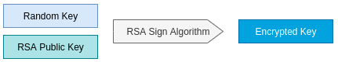
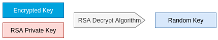
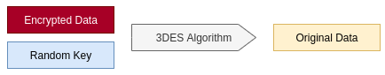

# TÀI LIỆU TÍCH HỢP B2B2C 

Tài liệu mô tả các vấn đề liên quan đến việc triển khai hình thức kết nối API giữa Đối tác B2B2C (trong tài liệu này gọi là Đối tác) và Gotadi. Cho phép người dùng trên hệ thống của Đối tác có thể thực hiện tìm kiếm, đặt vé máy bay/phòng khách sạn của Gotadi thông qua ứng dụng do Đối tác cung cấp.

---

## Tài liệu liên quan
- Thông tin kết nối giữa giữ Gotadi và Đối tác.
- Kịch bản kiểm kiểm thử.
- Source code mẫu.

---

## Thuật ngữ và viết tắt

- **URL** `Uniform Resource` *được dùng để tham chiếu tới tài nguyên trên Internet.*

- **SSL** `Secure Sockets Layer` *là các giao thức mật mã được thiết kế để cung cấp truyền thông an toàn qua Internet.*

- **HTTPS** `Hypertext Transfer Protocol Secure` *là một giao thức kết hợp giữa giao thức HTTP và giao thức bảo mật SSL hay TLS cho phép trao đổi thông tin một cách bảo mật trên Internet.*

- **3DES** `Triple DES (3DES hay TDES)` *là một thuật toán khóa đối xứng, áp dụng thuật toán mã hóa DES ba lần cho mỗi khối dữ liệu.*

- **RSA** `Rivest–Shamir–Adleman` *là một thuật toán mật mã hóa khóa công khai. Đây là thuật toán đầu tiên phù hợp với việc tạo ra chữ ký điện tử đồng thời với việc mã hóa.*

- **SHA-256** `Secure Hash Algorithm` *là giải thuật dùng để chuyển một đoạn dữ liệu nhất định thành một đoạn dữ liệu có chiều dài không đổi với xác suất khác biệt cao. SHA-256 (trả lại kết quả dài 256 bit)*

- **Chữ ký điện tử** *Thông tin đi kèm theo dữ liệu (văn bản, hình ảnh, video...) nhằm mục đích xác định người chủ của dữ liệu đó*

---

## Yêu cầu bảo mật

### 1. Kênh truyền SSL/HTTPS

SSL/HTTPS được áp dụng để truyền nhận dữ liệu giữa hệ thống của đối tác và Gotadi. Mục đích sử dụng SSL/HTTPS là giúp dữ liệu trao đổi giữa đối tác và Gotadi được mã hóa, khó bị đánh cắp và giả mạo.

### 2. Header bảo mật và thống kê lưu lượng truyền

Tất cả các request từ phía đối tác gọi sang hệ thống của Gotadi phải chứa các Headers bên dưới để phục vụ các nghiệp vụ về bảo mật và thống kê số liệu của Gotadi:

```
apikey: <api_key>
x-ibe-req-name: <access_code>
```
!!! note "Lưu ý"
    Giá trị `<api_key>` và `<access_code>` do Gotadi cung cấp cho Đối tác.

### 3. Mã hóa dữ liệu truyền và xác thực chữ ký điện tử

Request/response giữa Gotadi và Đối tác ở một số API quan trọng được yêu cầu mã hóa bằng thuật toán mã hóa bất đối xứng 3DES và kèm theo chữ ký điện tử để xác thực. Thuật toán mã hóa, giải mã sẽ được mô tả cụ thể trong tài liệu này.

!!! note "Lưu ý"
    Các API có yêu cầu mã hóa dữ liệu và kèm theo chữ ký điện tử sẽ được ghi chú ở phần Yêu cầu bảo mật.

#### 3.1 Mã hóa dữ liệu gửi đi

**Input** Original data, RSA PublicKey của bên nhận, RSA Private Key của bên gửi

**Output** Encrypted Key, Encrypted Data

???+ tip "Bước 1: Khởi tạo khóa ngẫu nhiên (Random key)"
    
    
    
    Hàm 3DES Key Generate được dùng để tạo random key dựa theo tiêu chí DESedeKeySpec (Độ dài key: 24 byte). Mỗi request/response sẽ được cấp một random key riêng biệt.

    Example: 
    === "Java"
        ```java
            public static byte[] generateKey() throws Exception {
                KeyGenerator keyGenerator = KeyGenerator.getInstance("DESede");
                SecretKey secretKey = keyGenerator.generateKey();
                SecretKeyFactory secretKeyFactory = SecretKeyFactory.getInstance("DESede");
                DESedeKeySpec deSedeKeySpec = (DESedeKeySpec) 	secretKeyFactory.getKeySpec(secretKey, DESedeKeySpec.class);
                byte[] randomKey = deSedeKeySpec.getKey();
                return randomKey;
            }

        ```

???+ tip "Bước 2: Mã hóa khóa ngẫu nhiên (Encrypted random key)"

    

    Random key được tạo ra ở bước 1 sẽ được mã hóa bằng thuật toán mã hóa bất đối xứng RSA bằng **Public key của bên nhận**.

    Example: 
    === "Java"
        ```java 
        public static String encryptRSA(byte[] randomKey, String xmlPublicKey) throws Exception {
            Cipher cipher = createCipherEncrypt(xmlPublicKey);
            byte[] encryptedKey = cipher.doFinal(randomKey);
            return Base64.encodeBase64URLSafeString(encryptedKey);
        }

        ```

???+ tip "Bước 3: Khởi tạo chữ ký chữ ký điện tử (Signature)"

    

    Bên gửi áp dụng thuật toán **RSA-SHA256** kết hợp với **Private key của chính mình** để ký chữ ký điện tử trên signature data.

    !!! note "Lưu ý"
        Schema để thành lập signature data sẽ được mô tả cụ thể ở từng API.

    Example:
    === "Java"
        ```java
        public static String signRSA(String signatureData, String xmlPrivateKey) throws Exception {
            PrivateKey privateKey = getPrivateKeyFromXML(xmlPrivateKey);
            Signature instance = Signature.getInstance("SHA256withRSA");
            instance.initSign(privateKey);
            instance.update(signatureData.getBytes("UTF-8"));
            byte[] signature = instance.sign();
            return Base64.encodeBase64String(signature);
        }

        ```

???+ tip "Bước 4: Mã hóa dữ liệu (Encrypted data)"

    

    **Original data có chứa signature** sẽ được mã hóa bằng thuật toán **3DES** với random key đã được tạo ra ở bước trước đó.

    !!! note "Lưu ý"
        Schema để thành lập original data sẽ được mô tả cụ thể ở từng API.

    Example:
    === "Java"
        ```java
        public static String encryptTripleDes(String originalData, byte[] randomKey) throws Exception {
            Cipher cipher = Cipher.getInstance("DESede");
            SecretKeySpec secretKeySpec = new SecretKeySpec(randomKey, "DESede");
            cipher.init(Cipher.ENCRYPT_MODE, secretKeySpec);
            byte[] encryptedData = cipher.doFinal(originalData.getBytes("UTF-8"));
            return Base64.encodeBase64URLSafeString(encryptedData);
        }

        ```

#### 3.2 Giải mã dữ liệu nhận được và xác thực chữ ký điện tử

**Input** Encrypted Key, Encrypted Data, RSA PrivateKey của bên nhận, RSA PublicKey của bên gửi

**Output** Original Data, Verify Result

???+ tip "Bước 1: Giải mã khóa ngẫu nhiên 3DES (Decrypted random key)"

    

    Bên nhận sử dụng **Private key của chính mình** để giải mã encrypted key nhận được.

    Example:
    === "Java"
        ```java
        public static byte[] decryptRSAToByte(String encryptedKey, String xmlPrivateKey) throws Exception {
            Cipher cipher = createCipherDecrypt(xmlPrivateKey);
            byte[] bts = Base64.decodeBase64(encryptedKey);
            byte[] randomKey = cipher.doFinal(bts);
            return randomKey;
        }

        ```

???+ tip "Bước 2: Giải mã dữ liệu (Decrypted data)"

    

    Bên nhận áp dụng thuật toán **3DES** kết hợp với random key có được ở bước trước đó, giải mã encrypted data để nhận được **original data có chứa signature**.

    !!! note "Lưu ý"
        Schema để thành lập original data sẽ được mô tả cụ thể ở từng API.

    Example:
    === "Java"
        ```java
        public static String decryptTripleDes(String encryptedData, byte[] randomKey) throws Exception {
            Cipher cipher = Cipher.getInstance("DESede");
            SecretKeySpec secretKeySpec = new SecretKeySpec(randomKey, "DESede");
            cipher.init(Cipher.DECRYPT_MODE, secretKeySpec);
            byte[] originalData  = cipher.doFinal(Base64.decodeBase64(encryptedData));
            return new String(originalData, "UTF-8");
        }

        ```

???+ tip "Bước 3: Xác thực chữ ký điện tử"

    

    Bên nhận sử dụng Thuật toán **RSA-SHA256 và Public key của bên gửi** để xác thực signature được lấy ra từ original data.

    Example:
    === "Java"
        ```java
        public static boolean verifyRSA(String signedData, String signature, String xmlPublicKey) throws Exception {
            PublicKey publicKey = getPublicKeyFromXML(xmlPublicKey);
            Signature instance = Signature.getInstance("SHA256withRSA");
            instance.initVerify(publicKey);
            instance.update(signedData.getBytes("UTF-8"));
            return instance.verify(Base64.decodeBase64(signature));
        }
        ```

---

## Kết nối

### 1. Quy trình kết nối

???+ tip "Bước 1"
    Đối tác cung cấp thông tin để Gotadi khởi tạo tài khoản đại lý trên môi trường sandbox. Thông tin bao gồm:

    - Thông tin công ty:

        - Tên công ty

        - Địa chỉ công ty

        - Địa chỉ website

    - Thông tin quản trị viên:

        - Họ tên

        - Địa chỉ email

        - Số điện thoại

    - Thông tin kết nối:

        - Đường dẫn tới hệ thống của đối tác: Link sản phẩm, Link cổng thanh toán, …

        - Các tài liệu tích hợp liên quan

        - Public key của đối tác. (RSA public key chiều dài tối thiểu 1024 bit)

???+ tip "Bước 2"
    Gotadi khởi tạo tài khoản dựa vào thông tin Đối tác cung cấp và gửi lại các thông tin tài khoản cho Đối tác. Thông tin bao gồm:

    - Link kích hoạt  tài khoản và đăng nhập vào B2B portal của Gotadi (Gửi vào email quản trị viên).

    - Đường dẫn tới hệ thống của Gotadi:  `<gotadi_api_gateway>`

    - Public key của Gotadi. (RSA public key chiều dài tối thiểu 1024 bit)
    
    - Tham số truyền vào request header:
    
        - Khóa truy cập API: `<api_key>`

        - Mã truy cập của đối tác: `<access_code>`

???+ tip "Bước 3"
    Đối tác kích hoạt tài khoản và sử dụng thông tin ở bước 2 tiến hành kết nối và kiểm thử trên môi trường sandbox

???+ tip "Bước 4"
    Nghiệm thu Sandbox và Golive dịch vụ

### 2. Các quy ước viết tắt

| Viết tắt  | Từ đầy đủ     | Mô tả                                 |
| --------- | ------------- | ------------------------------------- |
| M         | `Mandatory`   | Bắt buộc phải có khi gọi API.         |
| O         | `Optional`    | Không yêu cầu khi gọi API, tùy từng mục đích sử dụng mà có truyền tham số này không |
| C         | `Condition`   | Dựa trên Condition của field khác khi gọi API mà field này được quyết định là Mandatory hay Optional |

### 3. HTTP Response code

| Response code | Mô tả                                 |
| ------------- | ------------------------------------- |
| 200           | Success                               |
| 400           | Bad Request                           |
| 401           | Unauthorized                          |
| 402           | Forbidden                             |
| 402           | Not Found                             |
| 500           | Internal Server Error                 |
| 503           | Service Unavailable                   |

### 5. Các tham số phổ biến

- page (Integer, Optional)

    !!! quote ""

        Số thứ tự của trang (bắt đầu từ 0)

- size (Integer, Optional)

    !!! quote ""

        Số lượng phần tử của mỗi trang

- sort (String, Optional)
    
    !!! quote ""
        
        Mảng chứa tên trường và  kiểu sắp xếp dữ liệu.
        
        VD: id,desc,createdDate,asc

- duration (String, Optional)

    !!! quote ""

        Thời gian xử lý yêu cầu - Kể từ thời điểm nhận request đến thời điểm trả kết quả.

- success (Boolean, Required) 

    !!! quote ""
        
        Kết quả xử lý yêu cầu

- infos (Object[], Optional)

    !!! quote ""

        Mảng chứa thông tin mô tả kết quả ở các bước trong quá trình xử lý yêu cầu.

- errors (Object[], Optional)

    !!! quote ""

        Mảng chứa thông tin mô tả các lỗi đã xảy ra trong quá trình xử lý yêu cầu.

- textMessage (String, Optional)
    
    !!! quote ""
    
        Thông báo được đề xuất hiển thị cho người dùng.

- pageDTO (PageDTO, Optional) 

    !!! quote ""
        
        Đối tượng mô tả các thông tin phân trang: Số thứ tự của trang được trả về, số phần tử của mỗi trang, tổng số trang, ...

### 6. Luồng tương tác


### 7. Mã lỗi

|   Mã lỗi     | Mô tả                                                        |
| ------------ | ------------------------------------------------------------ |
| 00           | Yêu cầu đã được xử lý thành công.                            |
| 01           | Yêu cầu đang được xử lý.                                     |
| 02           | Yêu cầu đã được xử lý thất bại.                              |
| 03           | Yêu bị từ chối do Xác thực tài khoản đại lý khoản thất bại.  |
| 04           | Yêu bị từ chối do Chữ ký điện tử không hợp lệ.               |
| 05           | Yêu bị từ chối do Giải mã dữ liệu  không thành công.         |
| 06           | Yêu bị từ chối do Mã xác thực (Access Code) không hợp lệ.    |
| 07           | Yêu bị từ chối do Dữ liệu sai định dạng.                     |
| 08           | Yêu bị từ chối do Đã được xử lý trước đó.                    |
| 09           | Yêu cầu chưa được xử lý.                                     |
| 10           | Thông tin tài khoản không tìm thấy                                     |
| 99           | Lỗi khác.                                                    |

